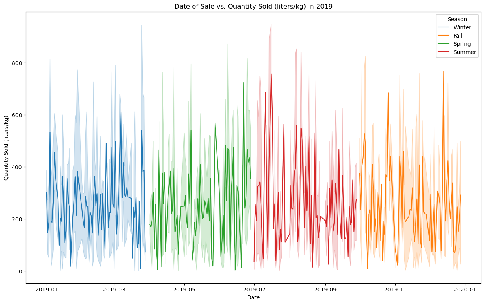
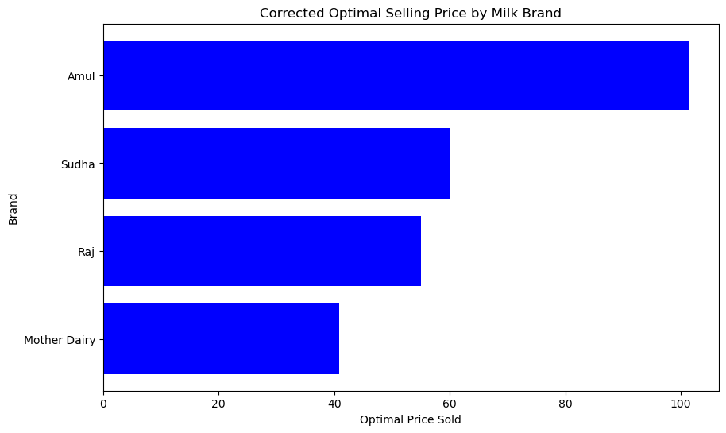
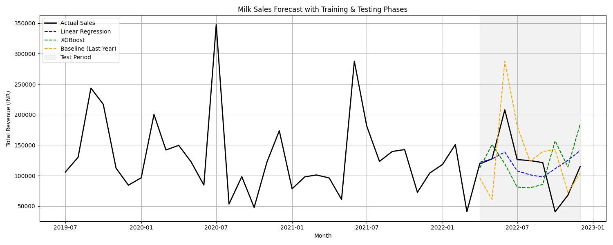

# Marketplace Product Inventory Prediction

A data science project analyzing dairy product sales data from India to predict out-of-stock situations and optimize pricing strategies.

## Background

This project analyzes a comprehensive dataset of dairy product sales across various Indian provinces. The data includes:
- Sales information from different factory suppliers (brands)
- Stock levels before and after sales
- Minimum reorder thresholds
- Order quantities
- Pricing information
- Revenue data
- Production and expiration dates

The dairy industry faces fluctuating demand throughout the year due to various factors. Out-of-Stock (OOS) situations can significantly impact both suppliers and consumers. By analyzing year seasonality, price elasticity, and factory capacity, we aim to develop predictive models that can help optimize inventory management and pricing strategies.

## Objectives

### Primary Objective
- Predict future sales quantities to prevent Out-of-Stock situations
- Determine optimal price points through price elasticity analysis
- Analyze seasonal patterns and their impact on sales

### Alternative Objectives
- Predict metrics on customer behavior
  - Build recommendation systems
  - Forecast next purchase date
  - Predict next purchase product type

## KPIs
- Model Performance Metrics
  - MAPE (Mean Absolute Percentage Error)
  - R-squared value
  - Mean Absolute Error (MAE)
  - Root Mean Square Error (RMSE)
- Price Elasticity Measurements

## Stakeholders
- Dairy Industry Businesses
  - Production Planning Teams
  - Inventory Management
  - Pricing Strategy Teams
- Supply Chain Managers
- Sales and Marketing Teams
- Financial Analysts
- Retail Partners

## Project Setup

### Running the Environment

1. Clone the repository
   ```bash
   git clone [repository-url]
   cd pmpi-inventory-predictor
   ```

2. Create and activate virtual environment
   ```bash
   python -m venv venv
   source venv/bin/activate  # On Mac/Linux
   ```

3. Install required packages
   ```bash
   pip install -r requirements.txt
   ```

4. Start Jupyter Notebook
   ```bash
   jupyter notebook
   ```

## Data
The dataset includes information on:
- Multiple dairy products (focusing on milk)
- Various brands (Amul, Mother Dairy, Raj, Sudha)
- Different sales channels (Retail, Wholesale)
- Production and expiration dates
- Price points and quantities
- Storage conditions
- Farm sizes

## Approach

### Price Elasticity Analysis
- Analyzed historical price and quantity data by brand
- Calculated price elasticity using percentage changes in price and quantity
- Determined optimal pricing for each brand based on elasticity values
- Applied price caps for inelastic brands (e.g., Amul) using historical maximums
- Visualized results using comparative price analysis charts

### Predictive Modeling Performance
- Feature Selection and Engineering:
  - Core features: price metrics, inventory levels, operational parameters
  - Created binary encodings for categorical variables
  - Generated temporal features from production dates
- Model Development:
  - Implemented XGBoost regression with optimized parameters
  - Used 80/20 train-test split
  - Evaluated performance using R², MAE, RMSE, MAPE, and MASE metrics
- Time Series Analysis:
  - Analyzed monthly sales patterns
  - Compared model predictions against naive forecasts
  - Visualized historical vs predicted trends by brand


## Results

### Seasonality analysis


### Price Elasticity Analysis
- Amul: Inelastic demand (elasticity value <1)
  - Optimal price: INR 101.50
  - Consistent demand regardless of price changes
- Mother Dairy: Elastic demand
  - Optimal price: INR 40.91
- Raj: Elastic demand
  - Optimal price: INR 54.96
- Sudha: Elastic demand
  - Optimal price: INR 60.13



### Predictive Modeling Performance
- Linear Regression: Outperformed baseline
  - Improved MAPE by several percentage points
- XGBoost Model: Shows potential for improvement
  - Currently underperforming but adaptable
- Baseline Model (Previous Year): MAPE = 48.61%



## Conclusions
- Price sensitivity varies significantly by brand
- Seasonal patterns impact sales volumes
- Linear regression provides reliable basic predictions
- Feature engineering opportunities exist for model improvement

### Future Implications
- Enhanced feature engineering for XGBoost optimization
- Integration of categorical features
- Development of more granular forecasting models
- Analysis of holiday and special event impacts


## Refrences
- [Dairy Goods Sales Dataset](https://www.kaggle.com/datasets/suraj520/dairy-goods-sales-dataset)
- [Milk Production by States/UTs | nddb.coop](https://www.nddb.coop/information/stats/milkprodstate) 
- [Price Elasticity - Definition, Formulas, Type of Demand](https://corporatefinanceinstitute.com/resources/economics/price-elasticity/)


## Team Members
This project is being developed for 2025 Spring Erdös Institute Data Science Boot Camp by:

- Kaili Cao
- Mary Reith
- Reggie Bain
- Santwana Dubey
- Tate Poole
- Zhongwei Wang

## License
todo
